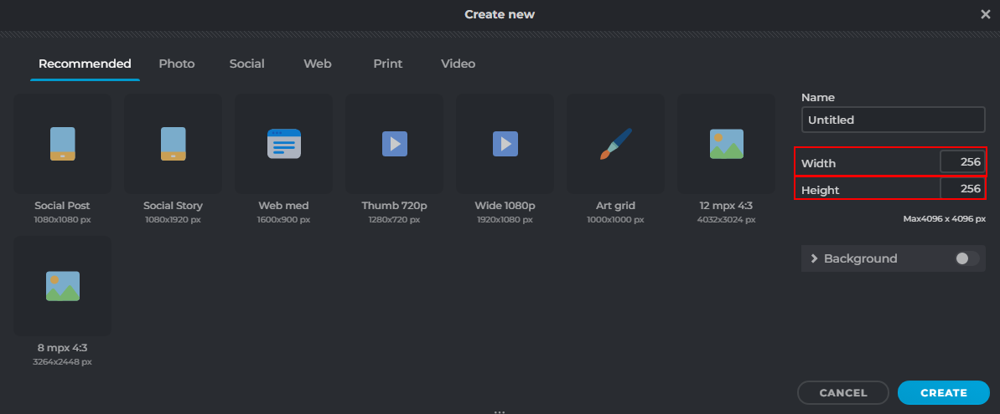
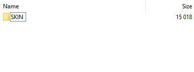

# Uploading to Thunderstore

### We'll use the included template below to help us upload to Thunderstore.




Unzip the `Template.zip` file.


### Here is the "Package Format Documentation" if you'd like: [https://thunderstore.io/package/create/docs/](https://thunderstore.io/package/create/docs/).

## 1. Skin .zip placement

Replace `SKIN.zip` with you own skin.

This is found in `Template\mods\SKIN_NAME\SKIN.zip`

You can also rename the `SKIN_NAME` folder to your preferred skin name.

## 2. Thunderstore Mod Icon

In `Template/mods/icon.png` replace `icon.png` with your own icon named `icon.png`.&#x20;


`icon.png` has to be 256x256 pixels in size.



This is the first thing people see when browsing Thunderstore.


If you need help with making this icon:

Making a 256 x 256  icon with Pixlr X

### Pixlr X:

Go to [https://pixlr.com/x/](https://pixlr.com/x/)

Also found in&#x20;

[#pixlr.com-free-website](../wiki/page-3.md#pixlr.com-free-website "mention")

### Creating the Image

Press `Create new` in the middle of webpage.

Make your file a Width of 256 and Height of 256.

Drop and drop your image you chose for an icon.

Select `Add current`.

Zoom out so you can see the resize guides.

Now move and scale the image to your preferred view.

#### "SNAPPING IS IN MY WAY!!!"

1. Click the 'Preferences' "settings" gear symbol in the bottom left.
2. Disable "Snap to guides"

#### Feel free to add text, background or whatever you want to your icon.

When you are satisfied\
Click 'Save' on the bottom right.

Make sure you have '256 x 256px' image size and Selected PNG for export.

Click 'Save As'

Rename the image and click 'Apply'

#### There it is. You made a 256x256 icon preview for your skin!

## 3. Customize your README.md


.md file types stand for Markdown. You can still edit these with standard text editors (like Notepad).&#x20;


It is recommended you use a previewer; either online or in a text editor. We can use [https://markdownlivepreview.com/](https://markdownlivepreview.com/) for this.&#x20;

You can also use [https://www.markdownguide.org/basic-syntax/](https://www.markdownguide.org/basic-syntax/) for syntax for formatting.

Or look at the README.md published on Thunderstore: [here](https://northstar.thunderstore.io/package/when\_you\_when\_i/SKIN\_NAME/0.0.2/).

#### Just customize the README.md to your liking.

Transfer from website. Save. Done

## 4. Configure manifest.json


To edit a .json files. Open them in text editors.


All you need to replace is `"SKIN_NAME",` and `"Description",`. Version number if you'd like.

Save. Done.

## 5. Finalizing the mod zip.

#### Make sure to zip the files. Not a containing folder!

So it's like this:

Not like:

You should now have your own `SKIN_NAME.zip` mod!

## 6. Uploading to Thunderstore


You CANNOT remove your mods once they are published onto Thunderstore.


sign in (i did github)

top left has upload

use old packer

do the requirements (skins, dds, nsfw if there is)

## 7. Finished.


