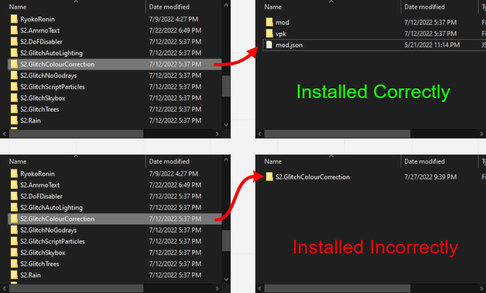
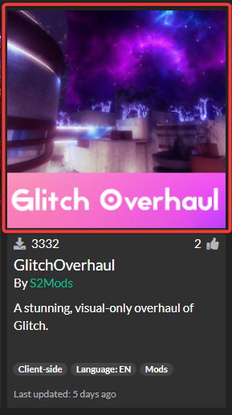
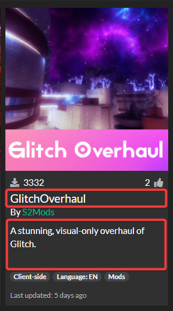
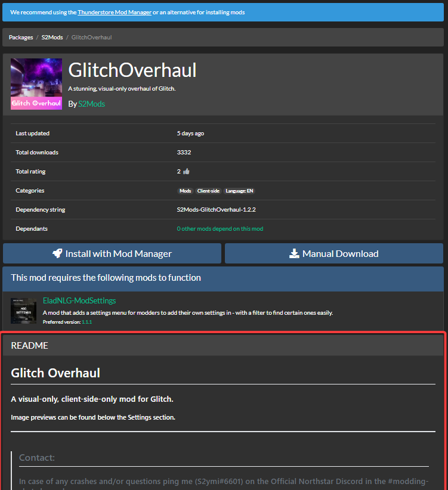

# Making a Thunderstore Mod

## Root Folder (every needed file):


This guide will go in order of files added. Make the folders or files needed.

## mods&#x20;

Put your mod here. Either zipped or just a folder. Make sure to not have nested files. Refer to image for what nested folders look like:



## icon.png



Your `icon.png` has to be 256x256 pixels in size. Be creative and put some effort into this. This is the first thing people see when browsing Thunderstore.&#x20;

<details>

<summary>If you need help making 256 x 256 Icon</summary>

### Pixlr X:

Go to [https://pixlr.com/x/](https://pixlr.com/x/)

Also found in&#x20;

[#pixlr.com-free-website](../archive/Tools\(old\).md#pixlr.com-free-website "mention")

### Creating the Image

Press `Create new` in the middle of webpage.


Make your file a Width of 256 and Height of 256.


Drop and drop your image you chose for an icon.

Select `Add current`.

Zoom out so you can see the resize guides.


Now move and scale the image to your preferred view.

#### "SNAPPING IS IN MY WAY!!!"

1. Click the 'Preferences' "settings" gear symbol in the bottom left.
2. Disable "Snap to guides"


#### Feel free to add text, background or whatever you want to your icon.

When you are satisfied\
Click 'Save' on the bottom right.

Make sure you have '256 x 256px' image size and Selected PNG for export.

Click 'Save As'

Rename the image and click 'Apply'

#### There it is. You made a 256x256 icon preview for your skin!

</details>

## manifest.json



This is the name and description to your on when browsing the Thunderstore. Just make a manifest.json. To edit a .json files, open them in text editors. Version numbers are important if you plan to update the mod or patch your mod. You can keep dependencies empty if you are using the old uploader. Dependencies only matter if you upload using the new uploader.

Example .json:

```
{
"name": "NAME",
"version_number": "0.0.0",
"website_url": "",
"description": "DESCRIPTION",
"dependencies": []
}
```

## README.md



After you click a mod. You'll see the mod page. Under the mod page you get to README.md. You get to customize this. Just make README.md file and open it in a text editor or use a website like: ([https://markdownlivepreview.com/](https://markdownlivepreview.com/)). Syntax here:([https://www.markdownguide.org/basic-syntax/](https://www.markdownguide.org/basic-syntax/)). Put some effort into this because if it's unclear people won't download and ignore your mod. Look at S2ymi's mod pages for good examples ([https://northstar.thunderstore.io/package/S2Mods/GlitchOverhaul/](https://northstar.thunderstore.io/package/S2Mods/GlitchOverhaul/)).&#x20;

## Finish

That is every part and what they do in a Thunderstore mod.&#x20;
